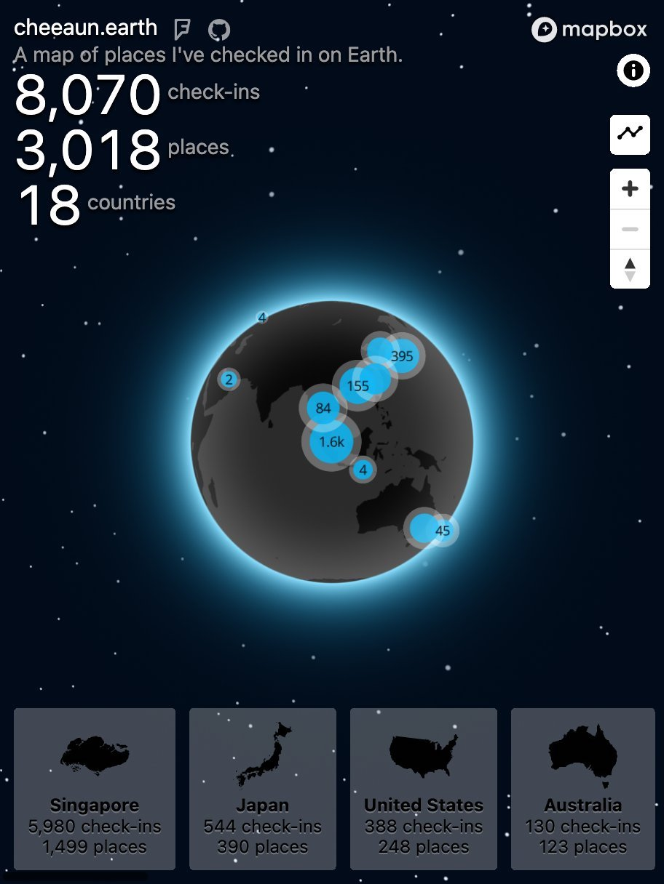

# 🌏 cheeaun.earth

> A map of places I've checked in on Earth.

[](https://cheeaun.earth/)

## Why

- I want to plot all the places I've been to on a map.
- I want a digital version of push pins on a physical map.
- I want to show people where I've been to.
- I want to see where I haven't been to.
- I want to try [Mapbox GL JS](https://www.mapbox.com/mapbox-gl-js/api/).
- I like the cool maps from [Gyroscope](https://gyrosco.pe/).
- I need an excuse to get a `.earth` TLD, inspired by [Conquer Earth](https://conquer.earth/). (I already have [`.life`](http://cheeaun.life/))

## Development

### First steps

1. [Generate access token](https://developer.foursquare.com/overview/auth) from Foursquare (requires your own CLIENT ID, etc; figure it out on your own).
2. Create `.env` file, with environment-specific variables on new lines:

```
ACCESS_TOKEN=XXX
```

### Wonderful `npm` scripts

- `npm run checkins` - Fetch all checks-ins from Foursquare. Raw `checkins.json` is not part of repo because of privacy. `checkins[.min].geojson` files have _shortened_ coordinates for privacy.
- `npm run countries` - Download a copy of country maps from [djaiss/mapsicon](https://github.com/djaiss/mapsicon). Then generate all optimized SVG countries.
- `npm start` - Watch and transpile `assets/app.raw.js`, and start the server.

## Future

- Make this available for other people. Self-hosted or hosted?
- Date & time range filtering, for check-ins.

## Related

- [Foursquare](https://foursquare.com/)
- [Swarm](https://www.swarmapp.com/)
- [Gyroscope](https://gyrosco.pe/)
- [Dustin Curtis](https://github.com/dcurtis)'s [Conquer Earth](https://conquer.earth/)
- [4sqmap](http://www.4sqmap.com/)
- [Where Do You Go](http://www.wheredoyougo.net/)
- [Your diary (on Foursquare)](http://diary.look4square.com/)
- [Foursquare's old Time Machine](https://thenextweb.com/insider/2013/06/13/great-scott-foursquares-time-machine-visualizes-your-past-check-ins-and-predicts-where-youll-go-next/) ([video](https://vimeo.com/148146749))

## License

Data powered by [Foursquare](https://foursquare.com/). Map powered by [Mapbox](https://www.mapbox.com/). Vector countries are from [djaiss/mapsicon](https://github.com/djaiss/mapsicon).

_Everything else..._

[MIT](https://cheeaun.mit-license.org/) © [Lim Chee Aun](http://cheeaun.com)
